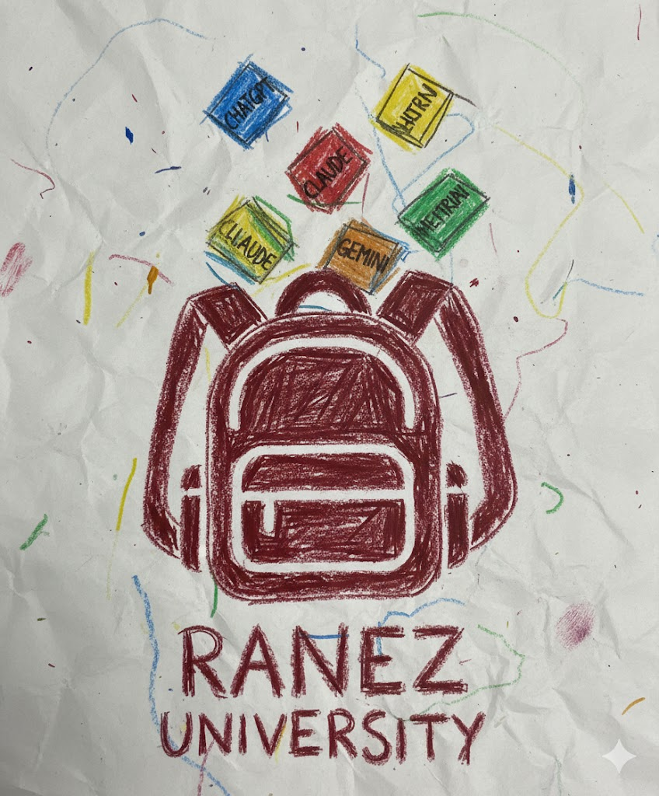

  

# Ranez University Community Project

Этот репозиторий является частью проекта комьюнити **Ranez University**.

---

## Контакты

- **Канал Telegram:** [https://t.me/airanez](https://t.me/airanez)  
- **Канал YouTube:** [https://www.youtube.com/@airanez](https://www.youtube.com/@airanez)

---

## Цель

Наработка навыков участниками комьюнити в области **искусственного интеллекта** и его применении в различных сферах.

---

## Краткое описание проекта `TG_BOT_RAG` 🤖

Создание бота на Telegram, который будет использовать технологии **искусственного интеллекта**, а также сопутствующие инструменты и сервисы для обработки и анализа данных.  

Для более подробного описания требований и функционала см. файл: [TG_Bot.md](./TG_Bot.md)
Для более подробного описания технической  реализации см. файл: [TID.md](./TID.md)